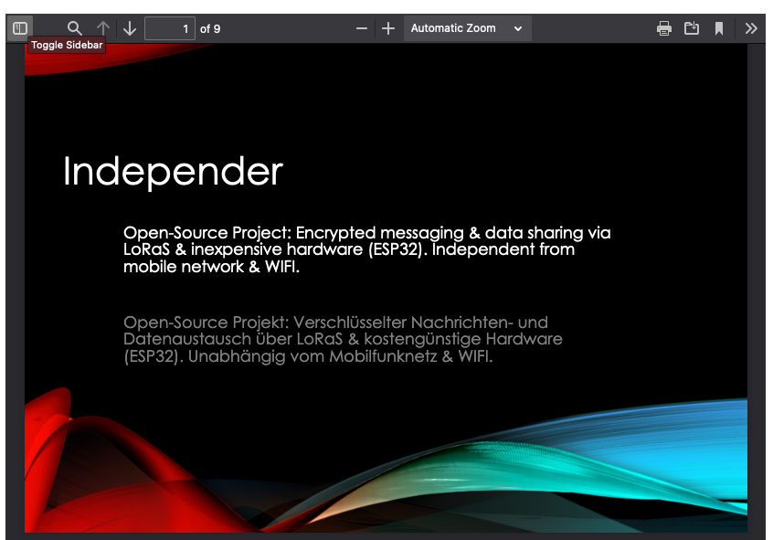

# Independer

This repository is about a device called **Independer**. An Open-Source Project.

**Encrypted messaging & data sharing** via LoRaS & inexpensive hardware (ESP32). **Independent from mobile network & WIFI**. We use cheap *ESP32s*, *LoRa antennas*, *3D prototyping*, *mini keyboards* and develop our own encrypted *protocol* together with *software*.

If you want to **join, or have an idea**, feel free to [write us](mailto:maximilian@bundscherer-online.de) or [start a discussion](https://github.com/maxbundscherer/independer-loras/discussions). The current state of development can be viewed on the [project board](https://github.com/maxbundscherer/independer-loras/projects/2).

Presentation             |  Prototype-Video
:-------------------------:|:-------------------------:
 | 

``esp32 - lora - encryption - short-message - protocol - keyboard - platformio - 3d-printing - independent``

## Features

- **Actor to Actor (via LoRaS)**: Send messages directly between two Actors.
- **Actor to Gateway (via LoRaS)**: Send messages via Gateway. Actors can query their messages from Gateways.
- **Actor to Actor (via WIFI/Internet)**: Send messages via Internet. Actors can query their messages from WIFI/Internet.
- **Who is near me?** Scan the environment to find other Independers.
- **Many other functions**: Various test functions (Reachability Check, Reception & Transmission Evaluation), Update via WIFI, Notification LED, Deep Sleep Mode, Background-Sync, Battery Status, Send Quota & Gain, NTP-Time-Sync, Auto-Sync, Auto-Sleep, Contacts...

## Specifications

- Built on inexpensive Hardware
- Open-Source Software & Protocol
- Open-Source 3D-printed Case
- Multiple ESP32-Boards Supported
- OLED-Screen
- LoRa & WIFI
- External Antenna Connector
- Mini Keyboard (QWERTY)
- 3000mAh LiPo Battery
- USB Charging (Micro-USB)

## Open-Source Project

Anyone can **contribute to the project** and **build their own device**. Many more features like GPS visualization, environment scanner, touch screen, alternative transmission and encryption functions are waiting **in the future**!

## Related links

- [How-to, Hardware and Cost Overview](docs/howto.md)
- [More Infos / Developer](https://github.com/maxbundscherer/independer-loras)
- [State of development](https://github.com/maxbundscherer/independer-loras/projects/2)
- [Releases](https://github.com/maxbundscherer/independer-loras/releases)


